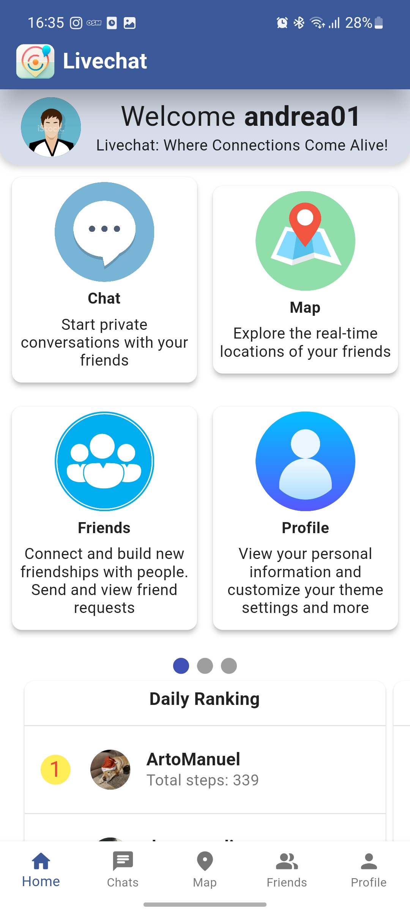
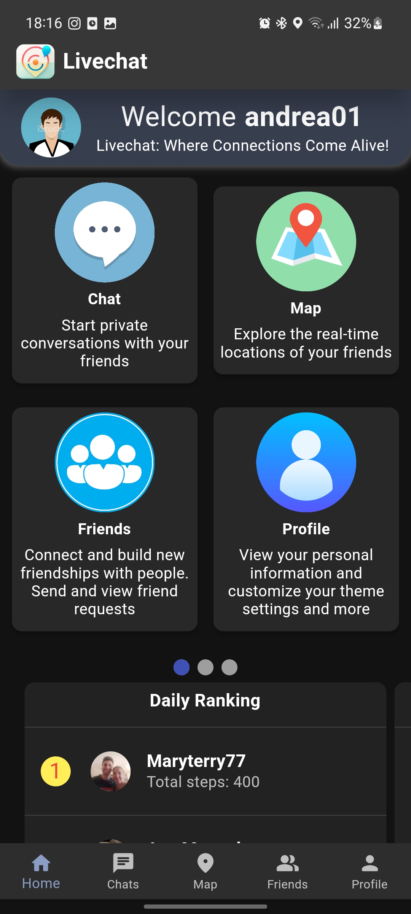
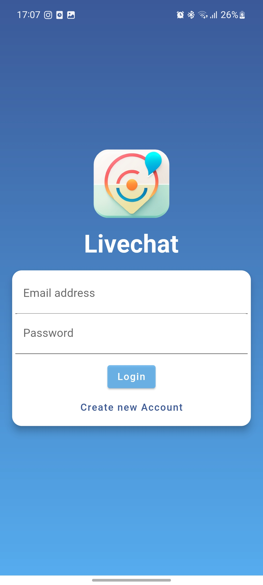
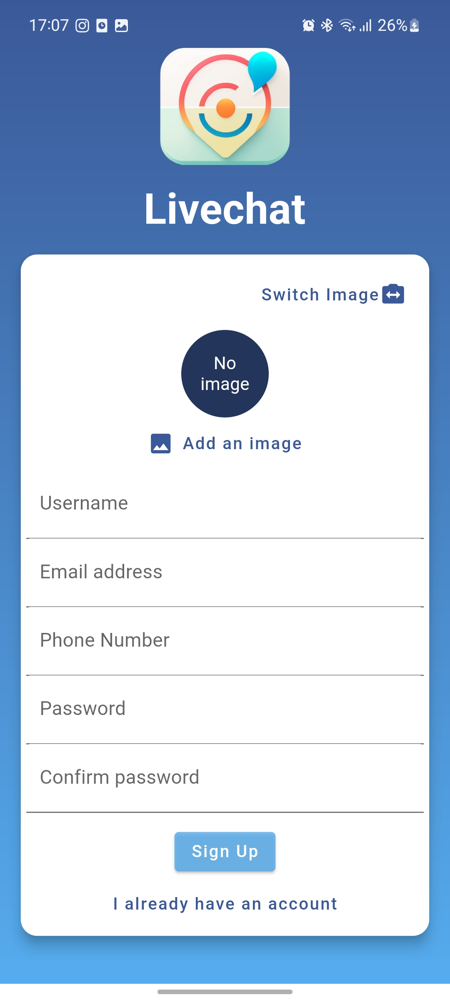
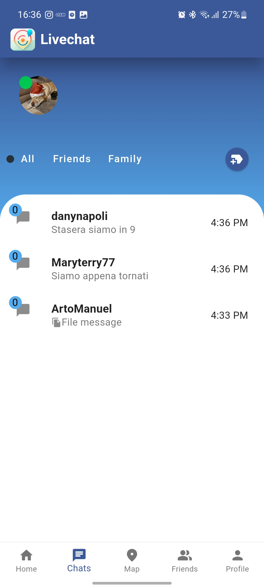
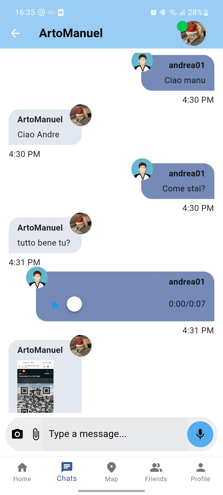
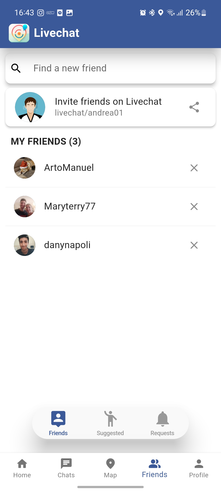
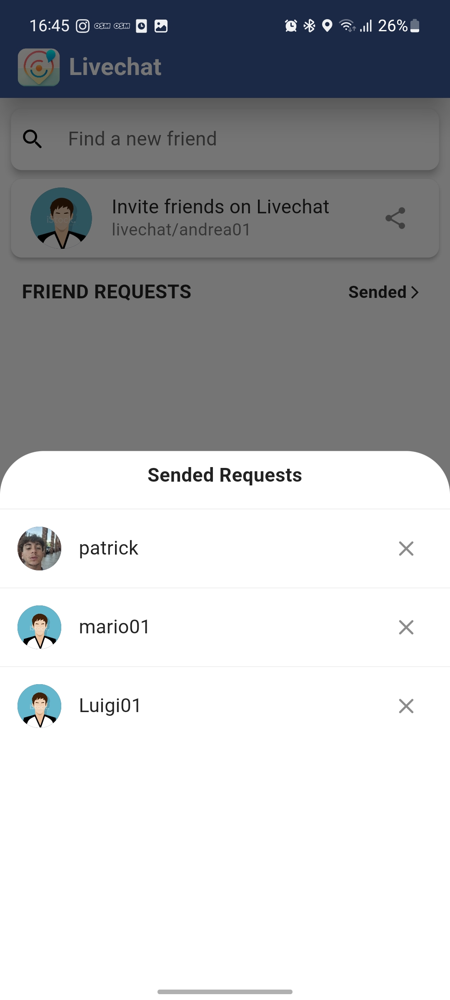
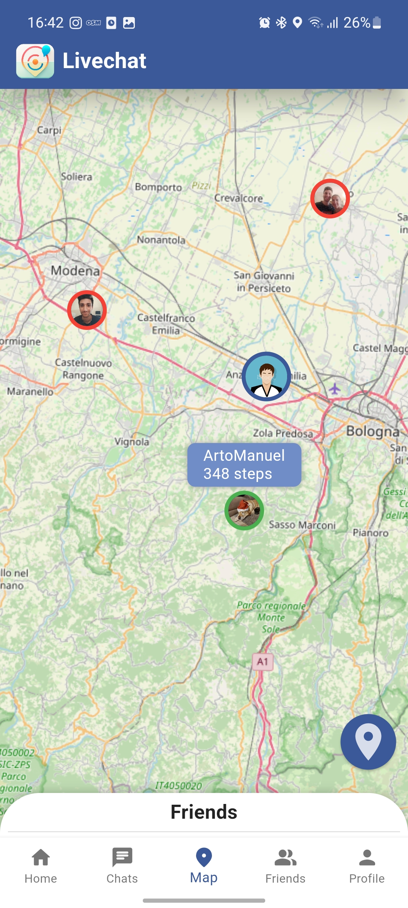
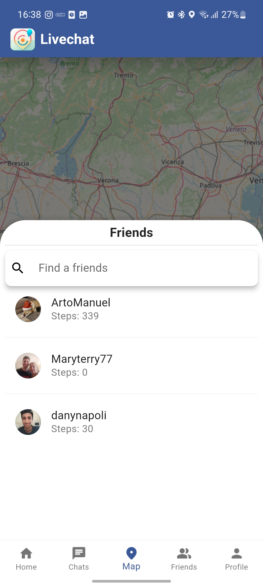

# Livechat
<br>

Livechat is a mobile messaging application with advanced social features such as real-time chat, location sharing and a leaderboard based on daily step counts. <br>

The app aims to create an interactive and engaging environment where users can communicate, organize conversations using labels, and share files, images, and audio messages.

Link for the APK Android app: [link](https://drive.google.com/file/d/1p6CDsgj8xyJc192Gn4C1V3d5hR6L9yZV/view)

<details>
	<summary>Some screenshots of the application</summary>
	<table style="text-align: center;">
		<tr>
			<td>Home Light and Dark Mode</td>
			<td>Login / Sign up</td>
		</tr>
		<tr>
			<td>
				
				
			</td>
			<td>
				
				
			</td>
		</tr>
		<tr>
			<td>Chat Tab</td>
			<td>Friends Tab</td>
		</tr>
		<tr>
			<td>
				
				
			</td>
			<td>
				
				
			</td>
		</tr>
		<tr>
			<td>Map Tab</td>
		</tr>
		<tr>
			<td>
				
				
			</td>
		</tr>
	</table>
</details>

## Components
The app is divided in three components:
* [APP](#app) (Frontend Flutter Application)
* [SERVER](#server) (Python FastAPI Backend Application)
* MongoDB (NoSQL database)

## Built with
* Flutter UI Toolkit
* FastAPI python framework
* JWT for authentication
* SocketIO for instant messaging
* MongoDB
* Docker
* Firebase Storage (used for users profile icons)

## APP
The app is developed using **Flutter**, a cross-platform framework that allows for the creation of native applications for both *Android* and *iOS*. <br>
It utilizes various packages and technologies to provide a seamless user experience and real-time data updates.

### Source Code
The source code of the app can be found in the ***/lib*** folder

### Getting Started
To build and run the Livechat Flutter app, follow these steps:

1. Ensure that Flutter and Dart are properly installed on your machine. You can refer to the official Flutter documentation for instructions on how to set up Flutter: [https://flutter.dev/docs/get-started/install](https://flutter.dev/docs/get-started/install)

2. Open a terminal or command prompt and navigate to the project's root directory.

3. Run the following command to fetch the dependencies:

   ```
   flutter pub get
   ```

4. Connect your mobile device or start an emulator.

5. Run the following command to build and launch the app on your device:

   ```
   flutter run
   ```

   This command will compile the app and deploy it to your device/emulator.


## SERVER
This is the server component of the LiveChat application. It allows clients to exchange messages, make friends and share locations and steps to each other.
### Source Code
The source code of the app can be found in the ***/app*** folder
### Getting Started
All users images are store on Firebase Storage, so you have to create your storage and add a 'credentials.json' file in the **/app/helpers** folder.

Then follow this steps:
1. Go to the /SERVER folder
2. Run the following command
	```bash 
	docker-compose-up
	```

Now go to http://127.0.0.1:8000/docs. You will see the automatic interactive API documentation (provided by Swagger UI)

## Additional Information
For more information on the app's functionality, code structure, and design choices, please refer to the complete report provided in the "REPORT.pdf" file.

If you encounter any issues or have any questions, feel free to reach out to the project contributors mentioned in the report.

Enjoy using Livechat!
